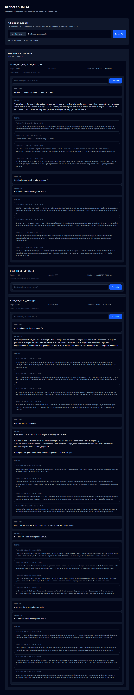

# AutoManual AI

API para consulta inteligente de manuais automotivos em PDF usando FastAPI, LangChain, OpenAI e ChromaDB.

O projeto permite enviar manuais em PDF, extrair e limpar texto, dividir o conteudo em chunks, indexar esses chunks em um vector store e responder perguntas com um fluxo RAG.

## Stack

- Python
- FastAPI
- Docker / Docker Compose
- pypdf
- LangChain
- OpenAI Embeddings
- ChromaDB

## O que ja foi implementado

- API FastAPI com health check.
- Upload de arquivos PDF.
- Extracao de texto de PDFs com `pypdf`.
- Limpeza basica do texto extraido.
- Divisao do texto em chunks com tamanho e sobreposicao configuraveis.
- Salvamento dos chunks em JSON.
- Indexacao dos chunks no ChromaDB usando embeddings da OpenAI.
- Busca semantica de chunks similares.
- Endpoint de chat usando RAG para responder perguntas com base no manual indexado.
- Retorno de fontes usadas na resposta, incluindo pagina, chunk, score e preview.

## Estrutura principal

```text
backend/
  app/
    api/
      routes/
        chat.py
        documents.py
    schemas/
      chat.py
    services/
      chunk_service.py
      document_service.py
      rag_service.py
      text_cleaning_service.py
      vector_store_service.py
    storage/
      chunks/
      uploads/
      vectorstore/
    main.py
  Dockerfile
  requirements.txt
docker-compose.yml
```

## Como executar

Configure a variavel `OPENAI_API_KEY` em `backend/.env`.

Suba a API com Docker Compose:

```bash
docker compose up --build
```

A API ficara disponivel em:

```text
http://localhost:8000
```

A documentacao interativa do FastAPI fica em:

```text
http://localhost:8000/docs
```

## Endpoints

### Health check

```http
GET /health
```

Retorna o status basico da API.

### Upload de PDF

```http
POST /documents/upload
```

Recebe um arquivo PDF e salva em `app/storage/uploads`.

### Extrair texto

```http
POST /documents/extract-text?file_path=<caminho_do_pdf>
```

Extrai texto do PDF e retorna um preview das primeiras paginas.

### Gerar chunks

```http
POST /documents/chunk?file_path=<caminho_do_pdf>&chunk_size=1000&chunk_overlap=200
```

Divide o texto extraido em chunks e retorna uma pre-visualizacao.

### Processar documento

```http
POST /documents/process?file_path=<caminho_do_pdf>&chunk_size=1000&chunk_overlap=200
```

Extrai texto, gera chunks e salva um arquivo JSON em `app/storage/chunks`.

### Indexar chunks

```http
POST /documents/index?chunks_file=<caminho_do_json_de_chunks>
```

Indexa os chunks no ChromaDB e retorna o `collection_name`.

### Buscar chunks similares

```http
POST /documents/search?collection_name=<collection_name>&query=<pergunta>&k=4
```

Executa busca semantica no vector store e retorna os chunks mais relevantes.

### Perguntar ao manual

```http
POST /chat/ask
```

Exemplo de payload:

```json
{
  "collection_name": "manual_a8f09cc3_7baa_4575_be64_fd6fa59a7b38",
  "question": "Como ligo a luz do veiculo?",
  "k": 4
}
```

Retorna a resposta gerada pelo modelo e as fontes usadas.

## Fluxo de uso

1. Envie um PDF em `/documents/upload`.
2. Use o `path` retornado para processar o documento em `/documents/process`.
3. Use o `chunks_file` retornado para indexar em `/documents/index`.
4. Use o `collection_name` retornado para perguntar em `/chat/ask`.

## Observacoes

- A indexacao usa o modelo `text-embedding-3-small`.
- O chat RAG usa o modelo `gpt-4o-mini`.
- O armazenamento local fica em `backend/app/storage`.
- A API depende de uma chave OpenAI valida em `backend/.env`.

### Chat com resposta e fontes


